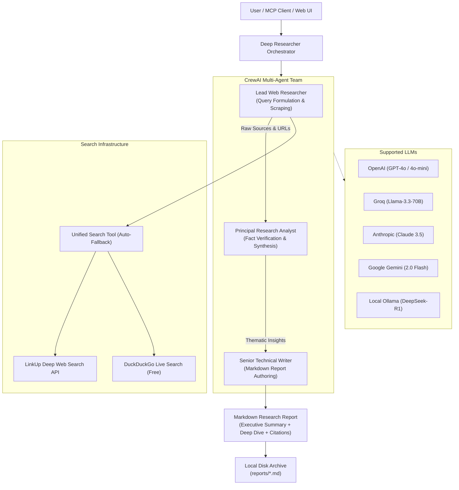

# 🔍 Multi-Agent Deep Researcher MCP

[](https://www.python.org/downloads/)
[](https://modelcontextprotocol.io)
[](https://crewai.com)
[](https://fastapi.tiangolo.com)
[](https://react.dev)
[](LICENSE)

An open-source, production-grade **Autonomous Multi-Agent Deep Research System** powered by [CrewAI](https://crewai.com), [Model Context Protocol (MCP)](https://modelcontextprotocol.io), and dual live web search engines ([LinkUp](https://www.linkup.so) & [DuckDuckGo](https://duckduckgo.com)).

Features a full **Model Context Protocol (MCP) server** for AI clients (Cursor, Claude Desktop, Antigravity, Windsurf), a **sleek modern React.js Web UI** (no authentication required), a **Streamlit UI**, and a **standalone CLI**.

---

## 🌟 Highlights & Key Features

- 🤖 **3-Stage Autonomous Multi-Agent Crew**:
  - **Lead Web Researcher**: Formulates multi-angle search queries, harvests live web results, and extracts primary source URLs.
  - **Principal Research Analyst**: Synthesizes conflicting data, cross-references claims, filters hype, and detects emerging trends.
  - **Senior Technical Writer**: Authors publication-grade Markdown reports structured with Executive Summaries, Thematic Deep Dives, Comparative Tables, Strategic Implications, and Verified Citations.
- 🔌 **Official Model Context Protocol (MCP) Server**:
  - Exposes `deep_research`, `quick_search`, `list_research_reports`, and `read_research_report` tools via `FastMCP`.
  - Includes dynamic research report resources (`research://reports/{report_name}`) and status monitoring (`research://status`).
  - Pre-configured MCP prompts (`deep_research_brief`, `competitive_analysis`).
  - Compatible with Cursor, Claude Desktop, Windsurf, and any standard MCP client over `stdio` or `sse`.
- 🌐 **Dual Web Search Engines**:
  - **LinkUp Deep Search**: Deep web search providing curated, sourced answers and structured data.
  - **DuckDuckGo (Free)**: Zero setup, privacy-preserving live web search out of the box—no API key required!
  - **Intelligent Fallback**: Seamlessly uses LinkUp when configured, and falls back to DuckDuckGo automatically.
- 🧠 **Multi-Provider LLM Orchestration**:
  - Auto-detects and connects to **Google Gemini** (`gemini-3.6-pro`, `gemini-3.8-flash`, `gemini-2.5-flash`), **OpenAI** (`gpt-4o`, `gpt-4o-mini`), **Groq** (`llama-3.3-70b`), **Anthropic** (`claude-3-5-sonnet`), **DeepSeek**, or local **Ollama** (`deepseek-r1`, `llama3`).
- 💻 **Modern React.js Web UI**:
  - **No login or authentication needed**—start researching immediately.
  - Live animated multi-agent activity stages with real-time status updates (SSE).
  - Rich Markdown report viewer with formatted typography, tables, and code snippets.
  - Extracted source links shelf with clickable citations.
  - 1-Click Copy Markdown, Download `.md`, and Print / Save to PDF.
  - Local research history archive drawer and in-browser settings modal.
- 🖥️ **Developer CLI**:
  - Command-line research utility with configurable depth and direct file export.
- ⚡ **Streamlit Interface**:
  - Retained and upgraded for users preferring python-only dashboards.

---

## 🏗️ System Architecture



---

## 🚀 Quickstart Guide

### 1. Prerequisites
- **Python**: `>= 3.11`
- **Node.js**: `>= 18.0` (for building the React frontend)
- [uv](https://docs.astral.sh/uv/) (recommended) or `pip`

### 2. Clone & Install

```bash
git clone https://github.com/your-username/Multi-Agent-deep-researcher-mcp.git
cd Multi-Agent-deep-researcher-mcp

# Option A: Quick installation with pip
pip install -r requirements.txt

# Option B: Synchronize virtual environment with uv (recommended)
uv sync
```

### 3. Build the React Web UI

```bash
cd frontend
npm install
npm run build
cd ..
```

*(Note: The production build is pre-compiled into `frontend/dist/` so the backend serves it automatically!)*

### 4. Configure Environment Variables

Copy `.env.example` to `.env`:

```bash
cp .env.example .env
```

Configure your preferred keys (DuckDuckGo search works immediately without any search key):

```env
# Optional Search Key (if omitted, DuckDuckGo is used automatically)
LINKUP_API_KEY=your_linkup_key_here

# Choose at least ONE LLM provider:
# Google Gemini (Default: Gemini 3.6 Pro - get key at https://aistudio.google.com/apikey)
GEMINI_API_KEY=AIzaSy...

# OR OpenAI:
OPENAI_API_KEY=sk-...

# OR Groq (free & ultra-fast):
GROQ_API_KEY=gsk_...

# OR Anthropic:
ANTHROPIC_API_KEY=sk-ant-...

# OR Local Ollama (default http://localhost:11434 with deepseek-r1:7b)
```

---

## 🖥️ Using the React Web UI

Launch the unified FastAPI server:

```bash
uv run python api.py
# or using the CLI command:
uv run deep-researcher-web
```

Open your browser at **`http://localhost:5000`**.

### Frontend Development Mode (Optional)
If you are developing or modifying the React components:
```bash
# Terminal 1: Backend API
uv run python api.py

# Terminal 2: React Vite Dev Server
cd frontend
npm run dev
```
Open **`http://localhost:5173`** with hot module reloading.

---

## 🔌 Connecting as an MCP Server

The project implements the official **Model Context Protocol (MCP)** specification. AI assistants like **Cursor**, **Claude Desktop**, **Antigravity**, or **Windsurf** can call the research agents directly as native tools.

### 1. Configuration for Cursor (`.cursor/mcp.json`)

Add to your project's `.cursor/mcp.json` or global configuration:

```json
{
  "mcpServers": {
    "deep_researcher": {
      "command": "uv",
      "args": [
        "--directory",
        "C:/path/to/Multi-Agent-deep-researcher-mcp",
        "run",
        "server.py"
      ],
      "env": {
        "OPENAI_API_KEY": "your_openai_api_key",
        "LINKUP_API_KEY": "your_linkup_api_key"
      }
    }
  }
}
```

### 2. Configuration for Claude Desktop

Edit your Claude Desktop configuration:
- **macOS**: `~/Library/Application Support/Claude/claude_desktop_config.json`
- **Windows**: `%APPDATA%\Claude\claude_desktop_config.json`

```json
{
  "mcpServers": {
    "deep-researcher": {
      "command": "uv",
      "args": [
        "--directory",
        "/absolute/path/to/Multi-Agent-deep-researcher-mcp",
        "run",
        "server.py"
      ],
      "env": {
        "OPENAI_API_KEY": "your_openai_api_key",
        "LINKUP_API_KEY": "your_linkup_api_key"
      }
    }
  }
}
```

### Available MCP Tools & Capabilities

| MCP Tool / Resource | Description | Parameters |
| :--- | :--- | :--- |
| `deep_research` | Autonomous multi-agent deep research investigation. Returns complete Markdown report with verified sources. | `query` (str), `depth` ("standard" \| "deep"), `search_engine` ("auto" \| "linkup" \| "duckduckgo"), `model`, `provider` |
| `quick_search` | Fast web search returning curated title, snippet, and URL citations. | `query` (str), `max_results` (int), `search_engine` |
| `list_research_reports`| Lists previously archived research reports from disk. | None |
| `read_research_report` | Reads full content of an archived research report. | `filename` (str) |
| `research://reports/{id}`| Dynamic MCP resource to read any report directly into model context. | `report_name` |
| `research://status` | Dynamic MCP resource providing server configuration & provider availability. | None |

---

## 💻 Developer Command Line (CLI)

Perform deep research straight from your terminal:

```bash
# Standard research on a topic
uv run deep-researcher-cli "Advancements in Quantum Computing 2026"

# Deep exhaustive research using DuckDuckGo and Groq
uv run deep-researcher-cli "Solid-state battery commercialization" --depth deep --engine duckduckgo --provider groq

# Quick live search lookup
uv run deep-researcher-cli "Python 3.13 release features" --quick

# Save output directly to a file
uv run deep-researcher-cli "Next-generation nuclear SMRs" -o smr_report.md
```

---

## ⚡ Streamlit Web Interface

If you prefer the lightweight Streamlit dashboard:

```bash
uv run streamlit run app.py
```

Features search engine toggles, model selector, API key configuration in the sidebar, and interactive chat history.

---

## ⚙️ Configuration Reference

| Environment Variable | Description | Default / Options |
| :--- | :--- | :--- |
| `LINKUP_API_KEY` | LinkUp Search API key ([Sign up](https://app.linkup.so/sign-up)) | Optional (falls back to DuckDuckGo) |
| `LLM_PROVIDER` | Preferred LLM provider | `openai`, `groq`, `anthropic`, `gemini`, `deepseek`, `ollama` |
| `LLM_MODEL` | Custom model name | `gpt-4o-mini`, `llama-3.3-70b-versatile`, `deepseek-r1:7b` |
| `OPENAI_API_KEY` | OpenAI API key | Optional |
| `GROQ_API_KEY` | Groq Cloud API key ([Free console](https://console.groq.com)) | Optional |
| `ANTHROPIC_API_KEY` | Anthropic Claude API key | Optional |
| `GEMINI_API_KEY` | Google AI Studio Gemini API key | Optional |
| `DEEPSEEK_API_KEY` | DeepSeek Platform API key | Optional |
| `OLLAMA_BASE_URL` | Ollama local API base URL | `http://localhost:11434` |
| `PORT` | Web API & UI port | `5000` |

---

## 🧪 Running Tests

Run the automated test suite verifying search tools, agent modules, MCP server registration, and FastAPI endpoints:

```bash
uv run python tests/test_researcher.py
```

---

## 🤝 Contributing

Contributions are warmly welcomed! Feel free to:
1. Fork the repository
2. Create your feature branch (`git checkout -b feature/amazing-feature`)
3. Commit your changes (`git commit -m 'Add amazing feature'`)
4. Push to the branch (`git push origin feature/amazing-feature`)
5. Open a Pull Request

---

## 📄 License

Distributed under the **MIT License**. See `LICENSE` for more information.
